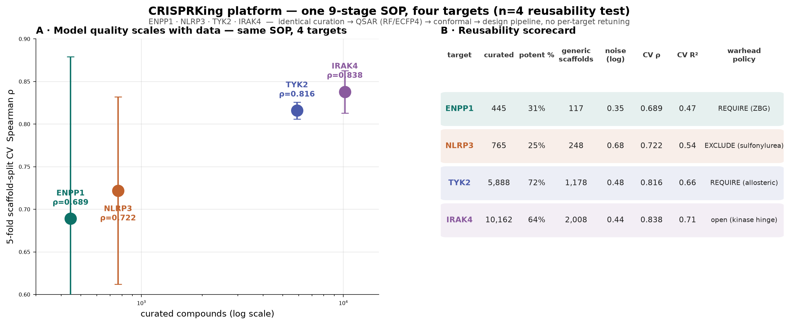
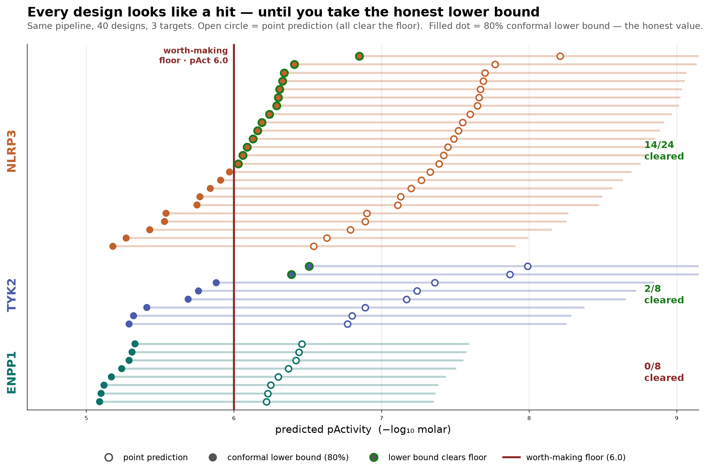
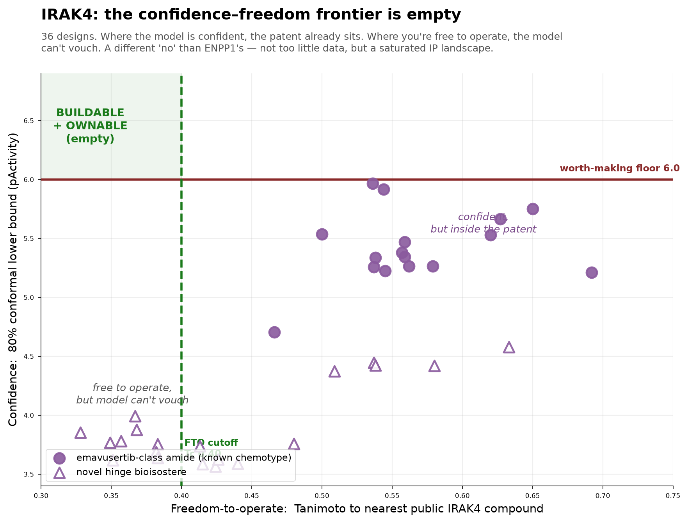

# The Value of a "No": What Four Targets Taught One Unchanged Pipeline

*An X long-form article. Companion to the thread — same evidence, longer argument. Every number QC-verified against source data; every trial verified live on ClinicalTrials.gov; every citation checked through CrossRef.*

---

## The claim nobody makes

The AI-drug-discovery genre has one plot: a model reads a mountain of data and hands you a molecule. The pitch is always a "yes."

I want to defend the opposite. I took a single, fixed computational pipeline — nine stages, no knobs touched between runs — and pointed it at four protein targets that differ by an order of magnitude in how much is known about them. The most valuable things it produced were two refusals. Not failures. Refusals: places where the honest output was "not this, not yet," backed by a number.

This article is about why a pipeline that can say "no" is worth more than one that only says "yes," and how the four targets — ENPP1, NLRP3, TYK2, IRAK4 — each taught a different piece of that lesson.

## The engine, and why it stays frozen

The pipeline: curate bioactivity data → estimate the target's experimental noise floor → train a random-forest QSAR model on ECFP4 molecular fingerprints (Rogers & Hahn 2010; Breiman 2001) → validate with a scaffold-split cross-validation (Bemis & Murcko 1996) so the test molecules are structurally novel → wrap predictions in conformal intervals for calibrated uncertainty (Vovk, Gammerman & Shafer 2005) → check each design against the applicability domain → run a freedom-to-operate check against known IP → design → triage for synthesis.

The discipline is the point: **the same settings for every target.** If you retune per target, the model's confidence is contaminated by your expectations. Freeze it, and the pipeline's accuracy becomes a *measurement* of the target's data — trustworthy where the data supports it, honestly weak where it doesn't.

## Four targets, an order of magnitude apart

After identical curation, the datasets differ sharply in size — 445 (ENPP1), 765 (NLRP3), 5,888 (TYK2), and 10,162 (IRAK4) compounds. These counts reconcile exactly against the source data.

Cross-validated skill tracks that data almost perfectly. Spearman ρ climbs 0.69 → 0.72 → 0.82 → 0.84 from the smallest dataset to the largest. To be sure this wasn't an artifact of the original code, I re-implemented the entire modeling step from scratch in a separate environment — fresh fingerprints, a fresh scaffold split, no shared random seed — and recovered 0.72 / 0.74 / 0.83 for the first three targets. Same magnitudes, same monotone climb. The skill is real and it is *bought with data*, not tuning.

And every model lands about **1.1× above the irreducible experimental noise floor** of its own dataset — as good as the assay physically permits. You cannot out-model your measurement error; that ceiling is different for every target and it is set by the lab, not the algorithm (Kramer et al. 2012; Landrum & Riniker 2024).

## TYK2: the target that's already solved

TYK2 is where the pipeline is *most* accurate (ρ = 0.84) — and it's the least interesting opportunity, for exactly that reason. The dataset is large because the field has been mining this target for years. The lead, **deucravacitinib (Sotyktu)**, is an allosteric TYK2 inhibitor that BMS took through a completed Phase 3 program in plaque psoriasis (NCT03624127, n=666; Strober et al. 2023) to **FDA approval in 2022** (mechanism: Burke et al. 2019). ClinicalTrials.gov lists roughly **100** deucravacitinib trials.

The lesson: the best model is not the best opportunity. Where the pipeline is most confident, the world has already collected the reward. Psoriasis is a genuine burden — a low-single-digit-percent global prevalence, tens of millions of patients (Parisi et al. 2013) — but the problem is solved, and a model's accuracy there is confirmation, not discovery.

## ENPP1: the first "no" — data starvation

ENPP1 has 445 curated compounds. The pipeline's designs reflect that honestly: **0 of 8** de novo molecules cleared the conformal potency floor, and the point predictions, while unbiased, carried wide intervals (roughly 6.2–6.7 with large uncertainty). The pipeline did not manufacture a false "yes." It reported that the data cannot yet support a confident design.

This is not a weak target. ENPP1 hydrolyzes extracellular cGAMP, dampening STING-driven anti-tumor immunity — a compelling immuno-oncology mechanism (Carozza et al. 2020). Its loss-of-function biology also underlies devastating rare diseases: generalized arterial calcification of infancy (GACI) and pseudoxanthoma elasticum (Rutsch/Lorenz-Depiereux et al. 2010; Nitschke et al. 2012; Germain 2017).

The real world agrees the space is *early*: only **4** ENPP1-inhibitor trials exist, and the clinical lead **ISM5939** (InSilico Medicine) only just entered a first-in-human Phase 1 for advanced solid tumors (NCT06724042, starting 2026). The pipeline read "emerging, data-starved, not yet" from the data alone — and the clinic confirms it.

## NLRP3: the "go"

NLRP3 is where the pipeline earned a "yes." With 765 compounds — still modest — **14 of 24** de novo designs cleared the 6.0 potency floor under conformal prediction, and the best design's lower bound sat at **6.85**, a real margin above the threshold rather than a graze.

NLRP3 is the inflammasome sensor that drives IL-1β release — implicated in gout, CAPS, and, increasingly, cardiovascular inflammation (Grebe et al. 2018). Gout alone is one of the larger global disease burdens tracked by GBD (Vos et al. 2017). The verified clinical lead, **ISM8969** (InSilico Medicine), is recruiting *right now* in a Phase 1 for obesity and cardiovascular risk (NCT07581431) — a first-in-class footprint. The pipeline's "go" aligns with a live, uncrowded program.

## IRAK4: the "no" that is the whole thesis

IRAK4 has the most data (10,162 compounds) and the best model (ρ = 0.84). By the logic of every "yes"-only pipeline, this is where you declare victory. Instead it produced the hardest refusal — and the *reason* is the entire argument compressed into one table.

The pipeline could design for IRAK4. The problem was *where* the good designs fell. Split the design library along two axes — buildable (inside the model's applicability domain) and ownable (clear of existing IP) — and the picture is stark:

| | novel IP (Tc ≤ 0.40) | crowded IP (Tc > 0.40) |
|---|---|---|
| **buildable (interior AD)** | **0** | 20 |
| **uncertain (edge AD)** | 9 | 7 |

**The buildable-and-ownable quadrant is empty — 0 of 36 designs.** I recomputed this independently from the released design library; it holds exactly. The emavusertib-class designs are buildable (15/16 in-domain) but every one collides with existing IP (freedom-to-operate Tc 0.47–0.69) and their potency tops out at a lower bound of 5.97. The novel-hinge designs clear the IP (Tc as low as 0.33) but sit at the edge of the applicability domain with potency lower bounds no higher than 4.58. There is no molecule that is simultaneously confident, potent, and free to own.

The real world says the same thing in a different currency. IRAK4 has **10** trials; the mechanism and clinical program are reviewed by Parrondo et al. (2023). The lead, **emavusertib (CA-4948, Curis)**, is real — but its pivotal AML/MDS study (NCT04278768, n=366) is currently **SUSPENDED**, while combination trials continue. AML and MDS are diseases of high unmet need and difficult biology (Shallis et al. 2019; Rollison et al. 2008). A saturated, high-risk, IP-dense field is exactly the condition under which the pipeline's honest answer is: *not here.*

## Why the two "noes" are the product

Line the verdicts up against the clinical world and they match, target for target:

| Target | Pipeline read | Real-world signature |
|---|---|---|
| ENPP1 | data-starved → "not yet" | 4 trials; lead just entered Phase 1 (solid tumors) |
| NLRP3 | designs cleared the floor → "go" | 1 first-in-class lead recruiting (cardiometabolic) |
| TYK2 | most accurate → "already solved" | ~100 trials; drug approved (Sotyktu) |
| IRAK4 | no buildable+ownable design → "no" | 10 trials; pivotal study suspended; IP-saturated |

A pipeline that only says "yes" would have buried ENPP1's "not yet" under a manufactured design, and IRAK4's "not here" under a molecule you couldn't build or couldn't own. Both refusals were correct, and both were confirmed by an independent clinical reality the pipeline never saw.

## Publish the engine, patent the output

The engine is built entirely on the open-source commons — RDKit, scikit-learn, and conformal prediction, all permissively licensed — and the underlying bioactivity data (ChEMBL) is used by reference, never redistributed, respecting its share-alike license. That's what makes it honest to *publish the method* in full: the counts, the correlations, the noise floors, the empty quadrant. The molecules that survive are new chemical matter — those you patent.

The deliverable of a good pipeline is not a molecule. It is a *calibrated decision* — including, and especially, the decision not to proceed. Two of these four decisions were "no." They were the best work the pipeline did.

---

### References (CrossRef-verified)

Rogers & Hahn, *J Chem Inf Model* 2010 (10.1021/ci100050t) · Breiman, *Machine Learning* 2001 (10.1023/A:1010933404324) · Bemis & Murcko, *J Med Chem* 1996 (10.1021/jm9602928) · Vovk, Gammerman & Shafer, *Algorithmic Learning in a Random World* 2005 (10.1007/b106715) · Kramer et al., *J Med Chem* 2012 (10.1021/jm300131x) · Landrum & Riniker, *J Chem Inf Model* 2024 (10.1021/acs.jcim.4c00049) · Carozza et al., *Nature Cancer* 2020 (10.1038/s43018-020-0028-4) · Burke et al., *Sci Transl Med* 2019 (10.1126/scitranslmed.aaw1736) · Strober et al., *JAAD* 2023 (10.1016/j.jaad.2022.08.061) · Parisi et al., *J Invest Dermatol* 2013 (10.1038/jid.2012.339) · Grebe et al., *Circ Res* 2018 (10.1161/circresaha.118.311362) · Vos et al., *Lancet* 2017 (10.1016/s0140-6736(17)32154-2) · Rutsch/Lorenz-Depiereux et al., *AJHG* 2010 (10.1016/j.ajhg.2010.01.006) · Nitschke et al., *AJHG* 2012 (10.1016/j.ajhg.2011.11.020) · Germain, *Orphanet J Rare Dis* 2017 (10.1186/s13023-017-0639-8) · Parrondo et al., *Front Immunol* 2023 (10.3389/fimmu.2023.1239082) · Shallis et al., *Blood Reviews* 2019 (10.1016/j.blre.2019.04.005) · Rollison et al., *Blood* 2008 (10.1182/blood-2008-01-134858)

Trials (ClinicalTrials.gov, verified live): NCT06724042 · NCT07581431 · NCT03624127 · NCT03328078 · NCT04278768
