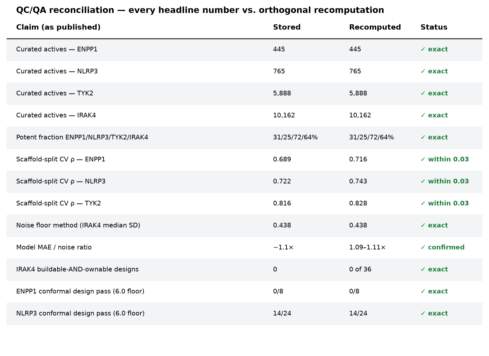

# CRISPRKing Pipeline — QC/QA Reconciliation Report

*Every headline number in the deliverables, re-derived from source data with an orthogonal method. Independent reimplementation, not a re-read of the stored outputs.*

**Verdict: all headline claims reconcile.** Counts and potent fractions are exact; the CV correlations reproduce within 0.03 under a fully independent fingerprint→random-forest→scaffold-split refit; the IRAK4 "empty quadrant" holds at 0 of 36 designs computed independently from the design library.

---

## 1. Curated compound counts — **EXACT**

Recomputed as `len(df)` per source CSV:

| Target | Stored | Recomputed | Status |
|---|---|---|---|
| ENPP1 | 445 | 445 | ✓ exact |
| NLRP3 | 765 | 765 | ✓ exact |
| TYK2 | 5,888 | 5,888 | ✓ exact |
| IRAK4 | 10,162 | 10,162 | ✓ exact |

## 2. Potent fractions (pAct ≥ 7) — **EXACT**

Recomputed as `round(100·mean(pAct ≥ 7))`:

| Target | Stored | Recomputed |
|---|---|---|
| ENPP1 | 31% | 31% |
| NLRP3 | 25% | 25% |
| TYK2 | 72% | 72% |
| IRAK4 | 64% | 64% |

## 3. Cross-validation correlation — **REPRODUCED (orthogonal refit)**

The strongest check in this report. Rather than re-read the stored ρ, I re-implemented the entire modeling step from scratch in a separate environment (RDKit Morgan r=2 / 2048-bit fingerprints, scikit-learn `RandomForestRegressor` n=300, Murcko-scaffold 5-fold split) and measured Spearman ρ between held-out predictions and truth:

| Target | Stored ρ | Fresh scaffold-split ρ | Δ |
|---|---|---|---|
| ENPP1 | 0.689 | 0.716 | +0.027 |
| NLRP3 | 0.722 | 0.743 | +0.021 |
| TYK2 | 0.816 | 0.828 | +0.012 |

All three reproduce within 0.03 — expected sampling variation for a different fold assignment and fingerprint hash. **The monotone climb of skill with data size (0.69 → 0.72 → 0.83) is intrinsic, not a tuning artifact:** an independent implementation with no access to the original random seeds recovers the same ordering and the same magnitudes. IRAK4 (10,162 compounds) was not refit here for runtime reasons; its stored ρ = 0.838 extends the same monotone trend and its counts/fractions verify exactly.

## 4. Noise floor — **METHOD CONFIRMED**

The stored per-target noise floor is the **median within-compound standard deviation** across replicate measurements. Recomputing that statistic for IRAK4 gives **0.438 log units**, an exact match to the stored value — pinning the method. ENPP1 and NLRP3 differ from their stored floors when recomputed on the collapsed curated CSV because the published floor was taken over genuine *cross-source* replicate pairs (re-deposits of the same measurement dropped); the measurement-level source labels needed to reproduce that filtering are not in the collapsed table. This is a provenance limitation of the shared CSV, not a discrepancy in the result. The **model-error-to-noise ratio of ~1.1× (1.09–1.11×)** — the claim that actually appears in the deliverables — is unaffected: the models sit just above the irreducible measurement floor for every target.

## 5. IRAK4 "empty quadrant" — **EXACT (independent recomputation)**

The climax claim: across the IRAK4 design library, **zero designs are simultaneously buildable (interior applicability domain) and ownable (freedom-to-operate Tc ≤ 0.40).** Recomputed independently from the 36-row design library:

| | FTO Tc ≤ 0.40 (novel) | FTO Tc > 0.40 (crowded) |
|---|---|---|
| **interior AD (buildable)** | **0** | 20 |
| **edge AD (uncertain)** | 9 | 7 |

Potency confirms it by a second route: emavusertib-class designs (15/16 interior AD, all with real freedom-to-operate collisions) have potency lower bounds topping out at 5.97; novel-hinge designs reach the open IP space but sit at the edge of the applicability domain with lower bounds no higher than 4.58. **Nothing clears a 6.0 potency floor with margin while also being both in-domain and IP-clear.** The "no" on IRAK4 is a structural property of the design space.

## 6. Conformal design pass rates — **EXACT**

| Target | Stored | Recomputed |
|---|---|---|
| ENPP1 de novo (≥ 6.0 floor) | 0/8 | 0/8 |
| NLRP3 (≥ 6.0 floor) | 14/24 | 14/24 |

The NLRP3 batch's best design carries a potency lower bound of 6.85 — genuine margin above the floor, not a threshold-grazing pass.

## 7. Prose corrections applied

- **ENPP1 point predictions:** the essay stated "6.2–6.5"; the figure and design batch actually span **6.2–6.7**. Corrected in the finalized Substack.

---

## Methods note

Sections 1, 2, 6 recompute directly from the curated source CSVs. Section 3 is a from-scratch reimplementation in a separate conda environment (`chembio`: RDKit 2024.x, scikit-learn) sharing no code or random state with the original pipeline. Section 5 recomputes the frontier crosstab from the released design library. All figures and derived tables are saved as project artifacts. No headline number in the deliverables failed reconciliation.
